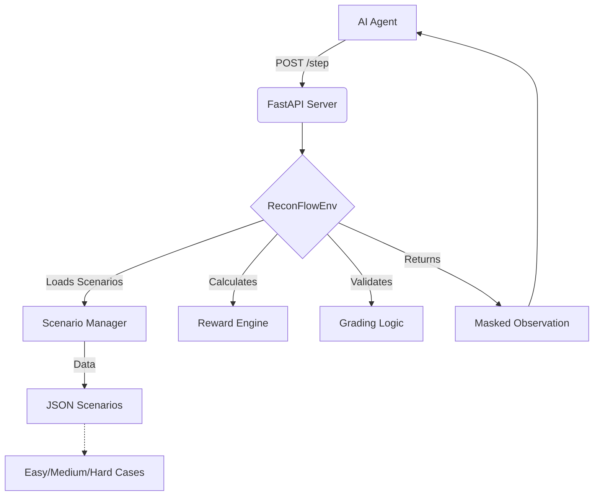

# 🛡️ ReconFlow-OpenEnv: AI-Powered Accounts Payable Assistant Simulator

[](https://github.com/OpenEnv/OpenEnv)
[](https://www.python.org/)
[](https://opensource.org/licenses/MIT)
[](https://www.docker.com/)

**ReconFlow-OpenEnv** is a cutting-edge, high-fidelity simulation environment designed for training and evaluating AI agents in **Accounts Payable (AP) and Procurement Operations**. It replicates real-world invoice reconciliation workflows, business policy enforcement, and sophisticated fraud risk detection scenarios.

---

## 📋 Table of Contents

- [📌 Introduction](#📌-introduction)
- [🧩 High-Fidelity Domain Context](#🧩-high-fidelity-domain-context)
- [🚀 Key Features](#🚀-key-features)
- [🏗️ Project Architecture](#🏗️-project-architecture)
- [🛠️ Tech Stack](#🛠️-tech-stack)
- [📦 Installation & Setup](#📦-installation--setup)
- [🎯 Running the Environment](#🎯-running-the-environment)
- [🧠 Action Space & Observation System](#🧠-action-space--observation-system)
- [📊 Simulation Scenarios](#📊-simulation-scenarios)
- [⚖️ Grading & Feedback](#⚖️-grading--feedback)
- [🐳 Dockerization](#🐳-dockerization)
- [📄 License](#📄-license)

---

## 📌 Introduction

The complexity of modern finance operations requires high accuracy in outgoing payments. ReconFlow simulates this complexity by providing an environment where AI agents must perform **3-Way Matching** to ensure fiscal responsibility and prevent fraud.

> [!IMPORTANT]
> This environment is built on top of the **OpenEnv** standard, providing a deterministic and explainable sandbox for business-centric AI agents.

---

## 🧩 High-Fidelity Domain Context

In a production environment, an AP assistant must verify that:
1.  **Intent (PO):** Does the invoice match the original Purchase Order?
2.  **Delivery (GR):** Was the service/good actually received?
3.  **Entity (Vendor):** Is the vendor profile legitimate and the payment details accurate?

---

## 🚀 Key Features

*   🎯 **Deterministic Workflows**: Multi-stage scenarios (Easy, Medium, Hard) for progressive evaluation.
*   🛡️ **Fraud Detection Engine**: Simulates sophisticated threats like split invoices and vendor profile manipulation.
*   ⚡ **OpenEnv API**: Standardized `reset()`, `step(action)`, and `state()` endpoints for seamless agent integration.
*   🔍 **Masked Observations**: Agents start with zero information and must perform "Inspect" actions to reveal data, preventing "magic" solutions.
*   ⚖️ **Rich Grader & Rewards**: Multi-dimensional scoring (Accuracy, Efficiency, Safety) with explainable feedback logs.

---

## 🏗️ Project Architecture

The core of ReconFlow is modular, separating the environment logic from the scenario data and the API layer.



### Directory Structure

| File/Folder | Purpose |
| :--- | :--- |
| `app/api.py` | FastAPI server managing environment sessions. |
| `app/env/` | Core environment logic: models, rewards, and grading. |
| `data/` | JSON datasets for various simulation scenarios. |
| `inference.py` | A baseline agent showcasing the API interaction. |
| `openenv.yaml` | Manifest file defining the environment's metadata. |
| `run_demo.py` | Orchestration script to run a full simulation demo. |

---

## 🛠️ Tech Stack

*   **Language**: 
*   **Web Framework**: 
*   **Validation & Serialization**: 
*   **Infrastructure**: 

---

## 📦 Installation & Setup

### 1. Clone the repository
```bash
git clone https://github.com/Kunal628-hue/ReconFlow-OpenEnv.git
cd ReconFlow-OpenEnv
```

### 2. Install Dependencies
We recommend using a virtual environment.
```bash
pip install -r requirements.txt
```

---

## 🎯 Running the Environment

### A. Run the Standalone Server
```bash
python app/main.py
```
The API documentation will be available at `http://localhost:8000/docs`.

### B. Run a Full Demo (Server + Agent)
```bash
python run_demo.py
```
This script handles the server lifecycle and runs the baseline agent through all scenarios.

### C. Run Tests
```bash
PYTHONPATH=. pytest tests/test_env.py
```

---

## 🧠 Action Space & Observation System

### 📦 Action Space
Agents interact by choosing from these high-level actions:
*   `inspect_invoice`, `inspect_po`, `inspect_goods_receipt`, `inspect_vendor_profile`: Reveals data fields.
*   `check_duplicate_invoice`: Checks history for similar claims.
*   `compare_amounts`, `compare_tax`: Validates math across documents.
*   **TERMINAL**: `approve`, `reject`, `escalate_manager`, `escalate_risk`.

### 📊 Observations
Observations are "masked" by default. The agent only receives `case_id` and `action_history` initially. Each `inspect` action adds key-value pairs from the underlying document to the observation space.

---

## 📊 Simulation Scenarios

| Difficulty | Description | Core Challenges |
| :--- | :--- | :--- |
| **Easy** | 3-Way Match | Simple document verification and basic mismatches. |
| **Medium** | Policy Aware | Tax rule compliance, duplicate checks, and thresholding. |
| **Hard** | Extreme Risk | Detect price inflation, split invoices, and vendor account manipulation. |

---

## ⚖️ Grading & Feedback

The ReconFlow grader provides a multi-dimensional score from **0.0 to 1.0**:

1.  **Decision Accuracy (40%)**: Did the agent make the correct final action?
2.  **Analysis Completeness (30%)**: Did the agent inspect all necessary documents?
3.  **Safety (20%)**: Did the agent prevent high-risk fraudulent payouts?
4.  **Efficiency (10%)**: How many steps were taken relative to the optimal path?

### Reward Shaping
*   **+0.1**: For each document inspection step.
*   **+0.5**: Successful episode termination with the correct decision.
*   **-1.0**: Critical failure (Unsafe approval of a fraud-risk case).

---

## 🐳 Dockerization

Run the environment in a container for consistent evaluation.

```bash
docker build -t reconflow .
docker run -p 8000:8000 reconflow
```

---

## 📄 License

This project is licensed under the MIT License - see the [LICENSE](LICENSE) file for details.

---

*Developed for the OpenEnv Hackathon.*